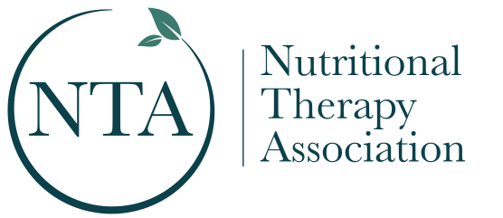

  

<h1 align="center">NTA Bot</h1>

  AI-powered knowledge assistant for NTA employees 
  <a href="https://grysngrhm-tech.github.io/nta-bot/">Open NTA Bot</a>

---

## What is NTA Bot?

NTA Bot is an internal AI assistant that helps NTA employees find answers across the full breadth of NTA's curriculum, reference textbooks, and supplementary content. Ask it about the Five Foundations, coaching methodology, nutrient biochemistry, scope of practice, or any health topic NTA teaches — it searches a curated knowledge base of over 6,400 entries and returns a clear answer with clickable source citations.

Every answer is grounded in NTA's own materials. The bot doesn't use the open internet or generate from its training data. Every claim is traceable to a specific curriculum lecture, textbook section, NIH fact sheet, or podcast episode.

## What Can You Ask?

- "Explain the north-to-south digestive process as taught in the NTP curriculum"
- "What's the difference in scope between an NTP and a PHWC?"
- "What are the signs and symptoms of magnesium deficiency?"
- "How does nutrition affect thyroid function?"
- "What coaching techniques does the PHWC program teach for building client trust?"
- "What does Dr. Gaby's Nutritional Medicine say about nutritional treatments for migraines?"

The bot handles curriculum deep-dives, quick scope-of-practice lookups, nutrient biochemistry questions, and clinical nutrition topics across body systems.

## Knowledge Base

NTA Bot searches across **6,402 curated entries** spanning NTA's own curriculum, four reference textbooks, government health references, and 86 podcast episodes. Every source goes through a processing pipeline that extracts educational content, removes filler, embeds it for semantic search, and tags it with metadata so the bot knows exactly where every piece of information came from.

### NTA Curriculum — 1,743 entries

The core of the knowledge base. Complete lecture transcripts from all three NTA programs, processed through GPT to extract educational content while preserving NTA's teaching voice and terminology.

**NTP Program** (1,005 entries from 16 modules) — Digestion (245), Blood Sugar Regulation (136), Bioindividual Nutrition (92), Supplements (92), Nutrient-Dense Diet (80), Stress Management (60), Case Study Intensive (55), NACA Clinical Application (82), Foundations Review (46), Anatomy & Physiology (44), Sleep (37), Lab Interpretation (31).

**PHWC Program** (531 entries from 81 video transcripts) — Client-centered relationships, trust and rapport, motivational interviewing, coaching skills, behavior change frameworks, scope of practice, ethics, powerful questions, goal setting, wellness wheel, and practicum across Weeks 1-29.

**Foundations of Healing** (207 entries from 31 transcripts) — The Five Foundations taught at a consumer-accessible level: Nutrient-Dense Diet, Digestion, Blood Sugar Regulation, Sleep, Stress Management, and Connecting the Foundations.

### Textbooks — 2,847 entries across 4 books

NTA's curriculum assigns two core science textbooks that are commercially copyrighted: *Introduction to the Human Body* by Tortora & Derrickson (A&P) and *Advanced Human Nutrition* by Medeiros & Wildman (nutritional biochemistry). Neither can be used directly in a RAG database. The knowledge base assembles equivalent coverage from free and licensed sources mapped to the same scope.

**Replacing Tortora — OpenStax Anatomy & Physiology, 1st edition** (643 entries, 28 chapters) — A standard college A&P textbook covering the same science as Tortora. The 1st edition was used because its content is identical to the 2nd in all areas relevant to NTA's curriculum (the 2e revisions were equity and inclusion language updates, not science changes). All body systems covered with tiered depth: full indexing for digestive, endocrine, immune, cardiovascular, and metabolic systems; breadcrumb coverage for skeletal, muscular, and nervous systems. Sourced from the philschatz/anatomy-book GitHub markdown port. CC BY 4.0.

**Replacing Medeiros & Wildman — three complementary sources.** No single free textbook matches *Advanced Human Nutrition* at its depth level, so coverage was assembled from three sources that together span the same scope:

- **Principles of Nutrition — Georgia Highlands College** (379 entries, 20 chapters) — Covers the macronutrient biochemistry and metabolism chapters: carbohydrate/lipid/protein structure and chemistry, digestion and absorption at the molecular level, glycolysis, beta-oxidation, TCA cycle, gluconeogenesis, ketogenesis, metabolic integration, micronutrients organized by metabolic function, lifespan nutrition (pregnancy through aging), and nutrition and fitness. CC BY-SA 4.0.
- **NIH Office of Dietary Supplements** (672 entries, 28 fact sheets) — Covers the vitamin and mineral chapters in more clinical detail than Medeiros & Wildman itself, with peer-reviewed data on biochemical function, recommended intakes, deficiency signs, toxicity, drug interactions, and health conditions for every vitamin and mineral. Public domain.
- **OpenStax Nutrition for Nurses** (405 entries, 20 chapters) — Fills a gap neither NTA textbook covers deeply: clinical nutrition organized by body system. Covers how nutrition impacts neurological, endocrine, hematologic, cardiovascular, pulmonary, renal, GI, and musculoskeletal systems across the lifespan. Nursing-specific content (care plans, compliance evaluation, clinical judgment frameworks) was filtered out — only nutritional science retained. CC BY 4.0.

**Separate clinical reference — Nutritional Medicine by Dr. Alan R. Gaby** (1,420 entries, 28 parts) — Not a replacement for either core textbook. This is a clinical reference NTA assigns for evidence-based nutritional treatment protocols covering 300+ conditions organized by body system, from cardiovascular disease to psychiatry. Commercially published — source material is proprietary and never included in this public repo.

NTA's three remaining assigned textbooks (*Signs and Symptoms Analysis from a Functional Perspective*, *Motivational Interviewing in Nutrition and Fitness*, and *The PEACE Process*) are proprietary methodologies covered through the curriculum transcripts rather than separate textbook ingestion.

### NIH Office of Dietary Supplements — 672 entries

Listed above as part of the Medeiros & Wildman replacement strategy. 28 peer-reviewed Health Professional fact sheets covering all vitamins, minerals, choline, and omega-3 fatty acids. Public domain.

### Podcast Library — 990 entries from 86 episodes

Every episode of the NTA *Nutritional Therapy and Wellness Podcast* was transcribed via OpenAI Whisper, then processed through GPT-4o to extract factual, educational content — not raw transcripts, but distilled reference entries organized by topic. Each citation links directly to the episode on Apple Podcasts.

### NTA Reference — 116 entries

Scope of practice documents (NTP, FNTP, PHWC boundaries and distinctions), program guides, credentials comparisons, NTA philosophy and terminology, and free consumer guides (Healthy Fats, Digestion, Herbal Recipes).

## How It Works

NTA Bot uses **Retrieval-Augmented Generation (RAG)** — instead of relying on what an AI memorized during training, it searches a curated knowledge base for every question and builds the answer from what it finds.

**1. Your question is embedded.** An AI model converts your question into a 3,072-dimensional vector that represents its meaning — so "how does sugar affect the brain" matches content about dopamine reward pathways even without those exact words.

**2. Hybrid search finds candidates.** The bot runs vector similarity search combined with keyword matching, pulling 30 candidate chunks from across all source categories.

**3. Candidates are reranked.** A second AI model reads each candidate and scores how well it actually answers your question. Curriculum content gets a slight scoring boost since it represents NTA's own teaching voice. A diversity step ensures the final results draw from different source types — curriculum, textbooks, external references, and podcast.

**4. AI writes the answer.** The top 10 ranked chunks are passed to GPT-5.4, which synthesizes a clear answer using only the retrieved content. Every answer includes collapsible source cards you can expand to view the original text or click through to the source.

## Features

| Feature | Description |
|---------|-------------|
| **Cited Sources** | Every answer includes collapsible source cards with authority badges (Curriculum, Textbook, NIH, Podcast, Web). Expand to view source text, or click through to the original. |
| **Rich Formatting** | Answers use bold, italics, and lists for easy scanning. |
| **Voice Input** | Tap the microphone to speak your question. |
| **Read Aloud** | Tap the speaker icon to hear any answer read back. |
| **Confidence Indicators** | High, Medium, or Low confidence so you know how well the knowledge base covered your question. |
| **Analytics Dashboard** | Topic demand vs coverage, trending topics, source usage, and a searchable question feed. |
| **Mobile Friendly** | Works on phone, tablet, and desktop — no install needed. |

## How to Access

| | |
|---|---|
| **URL** | [grysngrhm-tech.github.io/nta-bot/](https://grysngrhm-tech.github.io/nta-bot/) |
| **Password** | Provided by your NTA administrator |
| **Dashboard** | [grysngrhm-tech.github.io/nta-bot/dashboard.html](https://grysngrhm-tech.github.io/nta-bot/dashboard.html) |
| **Browsers** | Chrome, Safari, Edge, Firefox |

## Feedback & Contact

NTA Bot is actively maintained. The knowledge base can be expanded with new curriculum materials, podcast episodes, or reference content at any time.

For feedback, feature requests, or bug reports, contact **Grayson Graham**.

## Technical Architecture

Single-page PWA (vanilla HTML/CSS/JS) hosted on GitHub Pages. No backend server — static files talk to two cloud services:

- **n8n** (workflow automation) — RAG pipeline: receives questions, orchestrates search + AI calls, returns structured JSON
- **Supabase** (PostgreSQL + pgvector) — stores 6,402 knowledge chunks with 3,072-dim vector embeddings, runs hybrid search, logs analytics

AI models via OpenAI: **GPT-5.4 Standard** for answer synthesis, **GPT-5.4 Mini** for reranking, **text-embedding-3-large** for embeddings. Every chunk has a **contextual retrieval prefix** — an AI-generated sentence that bridges the chunk's structural position with its specific topic to improve search accuracy.

Designed and built by **Grayson Graham**.
